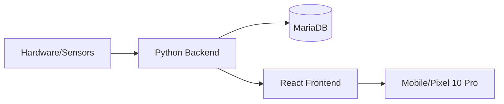

# 🌤️ IoT Weather Station - Full Stack Project

A complete end-to-end IoT solution for monitoring local and indoor weather conditions. This project tracks temperature, humidity, and atmospheric pressure using a custom sensor network and visualizes the data on a responsive web dashboard.

## Project Structure

This repository is divided into three main components:

* **[Part 1: Backend](./backend)**: A Python-based data collector and Flask REST API. It manages the MariaDB database and fetches data from sensors and external APIs.
* **[Part 2: Frontend](./frontend)**: A modern React dashboard built with Vite and TypeScript, featuring data visualization via Recharts.
* **[Part 3: Hardware](./hardware)**: C++ firmware for the Arduino Nano (sensor node) and WeMos D1 Mini (WiFi gateway).

---

## System Architecture

The data flows from the physical sensors to your digital dashboard:

1. **Collection**: An **Arduino Nano** reads indoor sensors and sends data via RF to the **WeMos D1 Mini**.
2. **Gateway**: The **WeMos D1 Mini** acts as a WiFi gateway, serving the data as JSON via a static IP or mDNS.
3. **Processing**: A **Python Service** on a Linux server fetches this JSON every 5 minutes and enriches it with outdoor data from the **Open-Meteo API**.
4. **Storage**: All validated data is stored in a **MariaDB** database.
5. **Access**: A **Flask API** serves the data to a **React Frontend**, which is accessible via **Tailscale** for secure remote monitoring.

## Global Technology Stack

* **Languages:** Python, TypeScript, C++, SQL.

* **Frameworks:** React (Vite), Flask.

* **Infrastructure:** MariaDB, Systemd (Linux Daemons), NVM (Node Version Manager).

* **Networking:** Tailscale VPN, mDNS, REST API (JSON).

## Quick Start

To get the entire system running, follow the setup guides in each sub-directory:

1. **Hardware:** Flash the sketches in /hardware to your microcontrollers.

2. **Backend:** Set up the MariaDB database and start the Python service following the Backend Guide.

3. **Frontend:** Build the dashboard using the instructions in the Frontend Guide.

4. **Automation:** Use the provided start.sh script to run the backend and frontend concurrently as a systemd service.

## Key Features

* **Data Integrity:** Implements a weighting algorithm on the gateway to ensure sensor accuracy.

* **Reliability:** Automated data collection via Linux-based daemon services.

* **Security:** Sensitive credentials managed via .env and remote access secured through Tailscale.

* **Modern UI:** Fully responsive dashboard with historical trend analysis and custom SVG icons.
